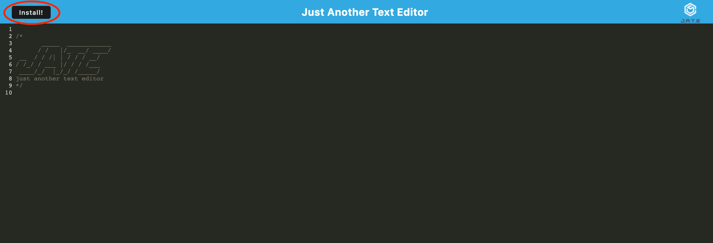

# Text Editor

[](https://opensource.org/licenses/ISC)

## Description

*Just Another Text Editor* – but a simple one for storing your 3am code snipets that pour forth from your febrile mind. It's alright you can go back to sleep... you didn't even have to turn the WiFi on. It works offline too.

This web application meets Progressive Web App (PWA) criteria. As such it features a number of data persistence techniques and functions offline.

The data is stored in an IndexedDB database and the app uses the necessary methods for getting and updating this data.

[Deployed web application](https://mqas1-text-editor.herokuapp.com/).
  
## Table of Contents
  
- [Description](#description)
- [Installation](#installation)
- [Usage](#usage)
- [Credits](#credits)
- [License](#license)
- [Contributing](#contributing)
  
## Installation

From the command line run the following command, ```npm run start```, to install the required packages and start up the backend and serve the client.

To install the desktop application, click on the install button on the top left of the browser app.


## Usage

Type or paste code into the text editor for safe keeping.

Install the desktop app by following the instructions above. Once installed the user can retrieve stored code, or edit and add more.

## Credits
Application by [edX](https://techbootcamp.sydney.edu.au/coding/) and configured to meet PWA criteria by [Morgan Qasabian](https://github.com/mqas1). 
  
## License
This application is covered under the [ISC License](https://opensource.org/licenses/ISC):
        
        Copyright 2023 edX/mqas1

        Permission to use, copy, modify, and/or distribute this software for any purpose with or without fee is hereby granted, provided that the above copyright notice and this permission notice appear in all copies.

        THE SOFTWARE IS PROVIDED "AS IS" AND THE AUTHOR DISCLAIMS ALL WARRANTIES WITH REGARD TO THIS SOFTWARE INCLUDING ALL IMPLIED WARRANTIES OF MERCHANTABILITY AND FITNESS. IN NO EVENT SHALL THE AUTHOR BE LIABLE FOR ANY SPECIAL, DIRECT, INDIRECT, OR CONSEQUENTIAL DAMAGES OR ANY DAMAGES WHATSOEVER RESULTING FROM LOSS OF USE, DATA OR PROFITS, WHETHER IN AN ACTION OF CONTRACT, NEGLIGENCE OR OTHER TORTIOUS ACTION, ARISING OUT OF OR IN CONNECTION WITH THE USE OR PERFORMANCE OF THIS SOFTWARE.
         
## Contributing
  
The guidelines for contributing to this application can be found at the [Contributor Covenant](https://www.contributor-covenant.org/).

---
  
*This README was made with ❤️ by the [README Generator](https://github.com/mqas1/readme-generator)*
